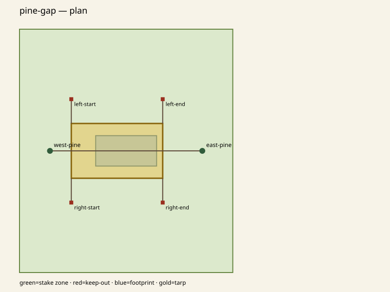

# TarpScout

[](https://github.com/KanadeK/tarpscout/actions/workflows/ci.yml)
[](https://www.python.org/)
[](LICENSE)

TarpScout is an offline command-line solver for the campsite you actually
measured. Give it support locations and attachment heights, stakeable polygons,
circular keep-outs, footprints that must stay covered, tarp dimensions, and the
cord segments in your bag. It searches deterministic A-frame and lean-to
geometry, assigns reusable cords exactly, and explains why blocked plans fail.

It produces stable JSON, CSV, labelled SVG diagrams, and a script-free HTML
report. There is no account, network request, runtime dependency, or uploaded
site data.

> TarpScout produces planning evidence—not structural, wind, weather, soil,
> tree, pole, knot, stake, or fabric-safety approval. Verify every pitch on site
> and follow equipment and land-manager instructions.



This is the actual `pine-gap` solver output: green is measured stakeable ground,
blue is the required footprint, gold is tarp coverage, and the labelled red
squares are recommended stakes.

[简体中文说明](docs/README.zh-CN.md) · [Input reference](docs/input-format.md) ·
[Troubleshooting](docs/troubleshooting.md) · [Why this is different](docs/novelty-research.md)

## Quick start

From a source checkout:

```powershell
git clone https://github.com/KanadeK/tarpscout.git
cd tarpscout
uv sync --locked
uv run tarpscout demo build/demo
```

The demo runs four real scenarios. `pine-gap` and `creek-lean-to` find plans;
`fire-ring` and `short-cords` intentionally return diagnostic no-solution
reports. The demo command itself exits `0` when all four runs complete.

After v0.1.0 is released, the standalone wheel can be installed directly:

```powershell
python -m pip install https://github.com/KanadeK/tarpscout/releases/download/v0.1.0/tarpscout-0.1.0-py3-none-any.whl
tarpscout demo demo-output
```

## Solve your site

Copy [the feasible example](examples/pine-gap.site.json), replace the measured
values, validate it, then solve:

```powershell
uv run tarpscout validate examples/pine-gap.site.json
uv run tarpscout solve examples/pine-gap.site.json --output build/pine-gap
```

A feasible solve writes:

```text
pine-gap.report.json     machine-readable candidates and diagnostics
pine-gap.lines.csv       ridge/guy lengths and assigned cord segments
pine-gap.plan.svg        labelled true-coordinate plan view
pine-gap.elevation.svg   ridge, edge, slope, and setback elevation
pine-gap.report.html     self-contained, script-free report with both SVGs
```

The same input and TarpScout version produce byte-identical files. A valid but
blocked survey writes only `<name>.report.json`, with counted rejection reasons
and repair suggestions. Reusing an output directory cannot leave stale solution
diagrams beside a new no-solution report.

## Examples

| Survey | Expected result | What it proves |
|---|---|---|
| `pine-gap.site.json` | `found` | A-frame search, footprint coverage, five-cord assignment |
| `creek-lean-to.site.json` | `found` | One-sided lean-to coverage and three-line assignment |
| `fire-ring.site.json` | `no_solution` | Circular keep-out rejection and repair hint |
| `short-cords.site.json` | `no_solution` | Exact reusable-cord shortage diagnosis |

The checked-in examples are tested against the installed demo data, so the two
entry points cannot silently drift.

## Exit codes

| Code | Meaning |
|---:|---|
| `0` | Input is valid, a solve found at least one plan, or the demo completed |
| `1` | Input is valid but no sampled plan satisfies all declared constraints |
| `2` | Invalid CLI usage, JSON/schema error, or filesystem failure |

`no_solution` is scoped to the declared measurements, pitch types, and finite
search grid. It is not proof that no real-world pitch exists.

## How it works

TarpScout parses JSON once into immutable dataclasses, enumerates a bounded
support/height/position grid, projects tarp coverage and stake positions, checks
every hard geometric constraint, performs exact one-to-one cord assignment, and
ranks feasible candidates deterministically. See [the architecture note](docs/architecture.md)
and [the v0.1.0 specification](docs/spec.md).

## Development and acceptance

Install [uv](https://docs.astral.sh/uv/), then run the one authoritative local
gate:

```powershell
uv sync --locked
uv run python scripts/check.py
```

The gate checks the lock, formatting, lint, strict types, at least 90% branch
coverage, all four demos twice for byte stability, wheel/sdist creation, a
deterministic demo ZIP, a clean wheel installation, and installed-console
`solve` plus `demo` execution. If it fails, use the focused repair flow in
[troubleshooting](docs/troubleshooting.md); do not skip tests or lower gates.

## Scope

v0.1.0 supports rectangular tarps, vertical point supports, simple stakeable
polygons, circular keep-outs, rotated rectangular covered footprints, and whole
reusable cord segments. It does not model fabric sag/catenary cuts, loads,
weather, soil, GPS terrain, free-form tarps, tents, hammocks, or live navigation.

## License

MIT. See [LICENSE](LICENSE).
